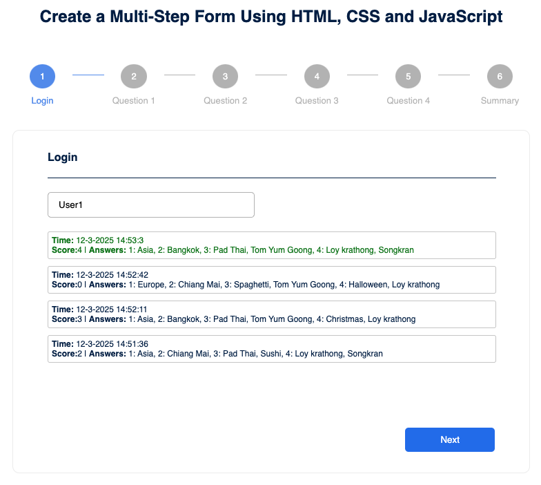
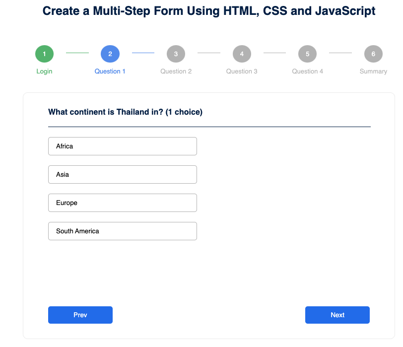
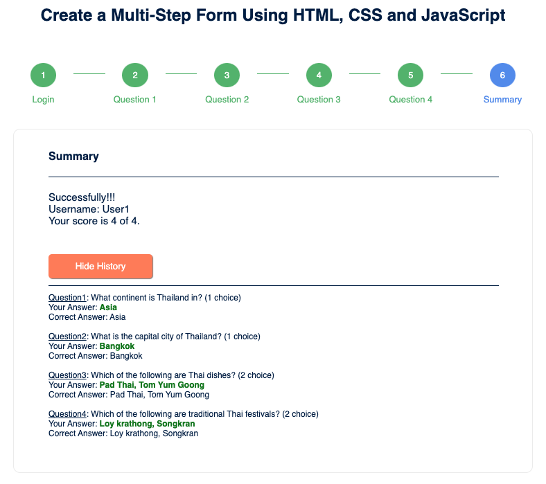

# Multi Step Form

## 📋 Overview

A web-based multi-step quiz application that allows users to answer questions step by step and get results at the end.

## 📸 Screenshots

- Login Page

  

- Quiz Page

  

- Summary Page

  

## 🌐 Live Demo

Explore the live version of the form here:
👉 https://zlatonn.github.io/multi-step-form/

## 🧑‍💻 Contributors

Zlatonn

## 📜 License

This project is licensed under the MIT License.
